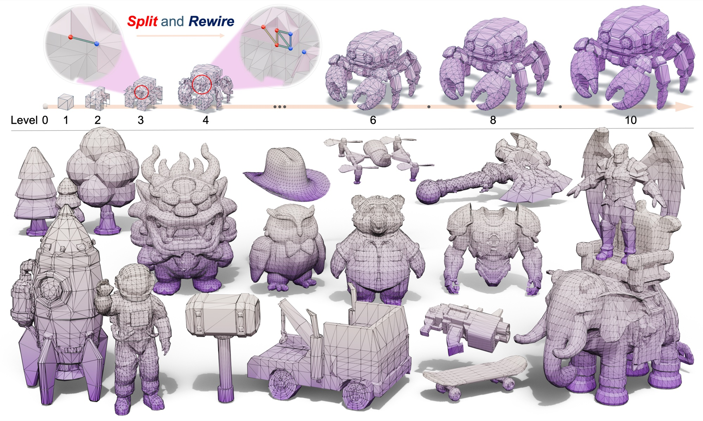

# MeshOctave: Vertex Split-and-Rewire Cascades for Native Mesh Generation

<a href="https://maymhappy.github.io">Junkai Lin</a>1,2,
<a href="https://tianhaozhao668.github.io">Tianhao Zhao</a>1,2,
<a href="https://lohhhha.github.io">Hang Long</a>1,2,
<a href="https://github.com/Ghuipeng">Huipeng Guo</a>1,
Jielei Zhang1,
<a href="https://youjiazhang.github.io">Youjia Zhang</a>1,2,
<a href="https://bluestyle97.github.io">Jiale Xu</a>2,
 
Wenbing Li1,2,
<a href="https://github.com/PENGUINLIONG">Rendong Liang</a>2,
Jozef Hladký3,
<a href="https://niessnerlab.org">Matthias Nießner</a>4,
<a href="https://yuanming.taichi.graphics">Yuanming Hu</a>2,
<a href="https://weiyang-hust.github.io">Wei Yang</a>1,†

1Huazhong University of Science and Technology &nbsp;
2Meshy AI &nbsp;
3Independent Researcher &nbsp;
4Technical University of Munich

†Corresponding author

